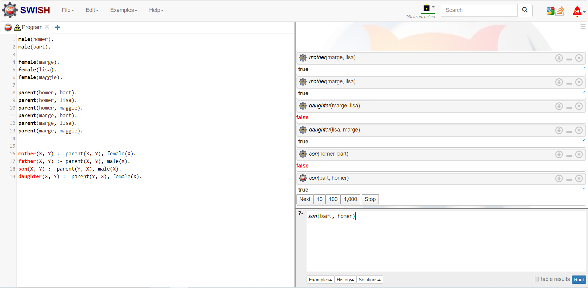

# IS2

IS LAB 2.

PROLOG.

The Simpsons Domain:
·       Entities = {Bart, Lisa, Maggie, Homer, Marge}

·       Relationships = {Male, Female, Parent, Father, Mother, Son, Daughter}

A Simpsons knowledge base:
male(homer).
male(bart).

female(marge).
female(lisa).
female(maggie).

parent(homer, bart).
parent(homer, lisa).
parent(homer, maggie).
parent(marge, bart).
parent(marge, lisa).
parent(marge, maggie).

mother(X, Y) :- parent(X, Y), female(X).
father(X, Y) :- parent(X, Y), male(X).
son(X, Y) :- parent(Y, X), male(X).
daughter(X, Y) :- parent(Y, X), female(X).

Для запуску скопіювати "A Simpsons knowledge base", наприклад в, https://swish.swi-prolog.org/ .
Нижче мій скрін. 

